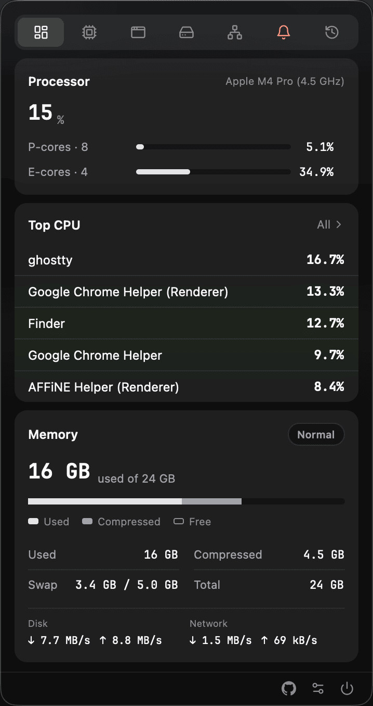

# zstats

English | [中文](README-zh.md)

A macOS menu-bar system monitor built around per-app rules: live CPU in the tray; process monitoring, threshold alerts each program can carry its own line for, and disk-space analysis with safe reclamation of regenerable caches.

**A menu-bar monitor that watches your machine your way.** Different apps deserve different rules — set them per app, get told when *your* lines are crossed, take the disk back.

The tray shows live CPU. Click for the panel — it tucks away when you look elsewhere. Collection, alerts and history run in-process on the [zstats](https://crates.io/crates/zstats) engine.

> macOS only · Apple Silicon and Intel · Universal, signed and notarized



## Why this one

Most menu-bar monitors paint pretty numbers, nag you, or both — and they treat every program the same. zstats starts from the opposite premise: **monitoring is personal**. The browser you live in all day is allowed 200% CPU; the daemon you forgot about should speak up at 30% — so every threshold here can be set per app, right on the panel, with sensible built-in templates covering the common cases before you configure anything. It still paints the numbers, still tells you when it matters, and then helps you act — disk full: find the 20 GB build cache and trash it the way Finder would (recoverable); memory tight: ask the biggest consumer to quit politely (⌘Q-equivalent).

## Watch

- Live CPU% beside the tray icon — and while a memory alert you have not dismissed is on the Alerts tab (a process, an app, or kernel pressure), the item turns into a memory stick with the memory still available instead. Or pin it to CPU or memory for good, or keep both side by side
- Overview: P/E cores, memory and compression, kernel memory pressure, disk and network throughput
- Apps aggregated by process tree — one row for a browser and all its helpers
- Processes ranked by a 60-second average, with a name filter and a one-click full-table scan
- Hardware: volumes, hottest sensors first, battery health
- History: what actually burned CPU *today*, ranked by accumulated time, not a spike

## Alert

The headline is **a base threshold combined with per-program ones**: one global line as the floor, and any program can carry its own — on one machine a browser may be allowed 200% CPU while a background daemon should speak up at 30%. A program's own line wins where set, the base line covers the rest, edited right on the panel. Built-in templates cover the common cases with sensible defaults, so **alerts are meaningful out of the box, before you configure anything**.

- CPU, memory, disk and memory-pressure thresholds, evaluated by zstats' rule engine
- **Two granularities**: rules watch the single **process** and, separately, the whole **application** — its process tree summed. A runaway helper trips the process line; a browser quietly holding 4 GB across 37 helpers trips the application line, though no single member ever crosses one. Each level carries its own base threshold and its own per-name overrides
- **Slow burns get named too**: a process holding CPU for hours without ever crossing a line (25% for an hour, say) is called out by the sustained-load watcher — delivered as a silent banner, never a nag. How long counts as "sustained", and how far under the alert line the bar sits, are yours to set
- Native notification banners; snooze an episode for 1 or 3 hours
- Memory-pressure cards list the top consumers and offer a polite quit (⌘Q / SIGTERM — never SIGKILL)

## Reclaim disk

- **Large files, instantly** — straight from macOS's own Spotlight index, no disk walk: ≥500 MB (drops to ≥100 MB when few match)
- **Directory analysis** — a background walk of your home tree (hundreds of thousands of directories in about half a minute) into three rankings: regenerable caches (`CACHEDIR.TAG`), fat directories, and files the index never sees
- Both live in a window of their own, wide enough to read a path in full; results stream while the walk runs, click a folder to drill in, pick the analysis root
- Cleanup suggestions **speak only by rule**: a directory either carries a signature-checked `CACHEDIR.TAG` (the owner's own declaration that it is regenerable) or matches a cache list compiled from **each tool's official documentation** (npm, Cargo, Xcode, …) — name-based guesses are labelled, never suggested. One click to the Trash, with the owner's own cleanup command shown
- Rules you can replace: drop a `~/.zstats/cleanhints-macos.toml` to override the built-in list

## Safety

The panel acts on the system in exactly two places, both behind a confirm, both reversible:

| Action | What it actually does |
| --- | --- |
| Delete | Finder's move-to-Trash. Never `rm -rf`. |
| Quit | A ⌘Q-equivalent request / SIGTERM. Never SIGKILL. |

Nothing is cleaned or killed automatically. Mail, Messages and other protected data are skipped without a touch. The one-time Desktop / Documents / Downloads prompt on first analysis *is* the analysis.

## Install

Download `zstats.dmg` from [Releases](../../releases) and drag it into Applications.

```bash
make bundle          # or build from source (needs cargo-bundle)
```

Language, theme, the tray's face, panel opacity and the sustained-load knobs live in a settings window. The UI is fully bilingual; dark and light modes use native vibrancy.

## Develop

```bash
make dev             # panel stays open
make lint && make test
```

Design notes: [docs/design.md](docs/design.md) · [docs/disk-analysis.md](docs/disk-analysis.md)

Apache-2.0 · [gpui](https://github.com/zed-industries/zed) · [zstats](https://crates.io/crates/zstats)
